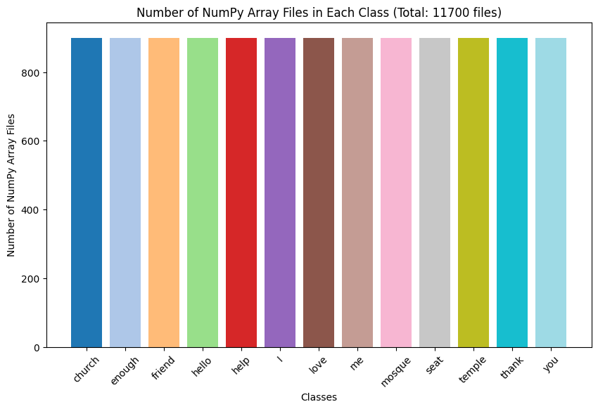

# Dataset

- This dataset contains data for the Kenyan Sign Language (KSL) recognition project. It is designed to aid in training machine learning models for recognizing various signs.

## Usage

- To use the dataset for this project, follow these steps:

  1. Load the extracted dataset found [here](./Dataset).
  2. Download the dataset from [here](https://www.kaggle.com/datasets/michaelmwai/ksl-numpy-array-files-dataset).

## Visualization

- The dataset contains 13 gesture classes where each class contained 900 NumPy array files that were trained on the Machine Learning (ML) model.

  
