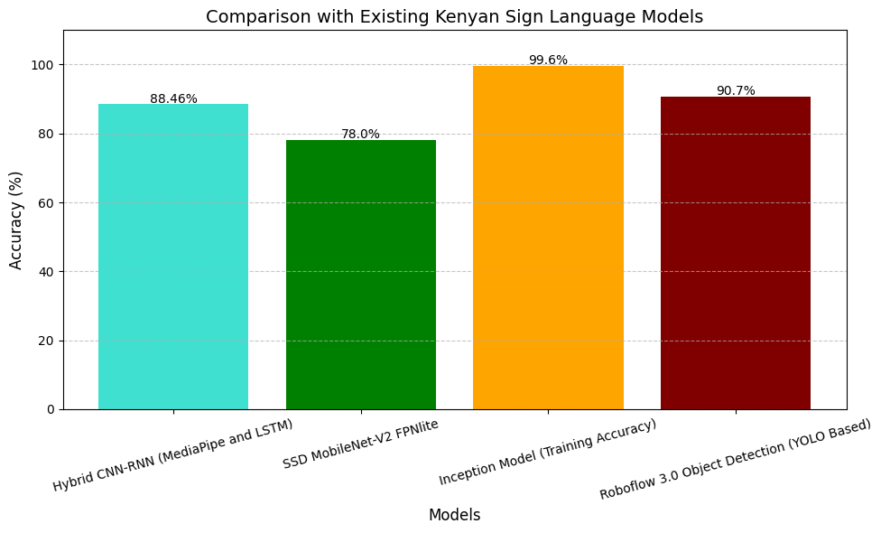
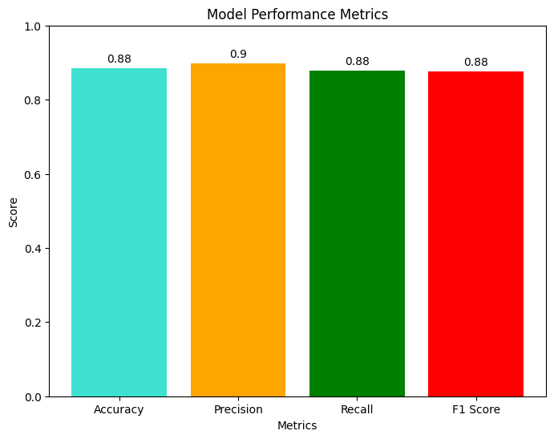
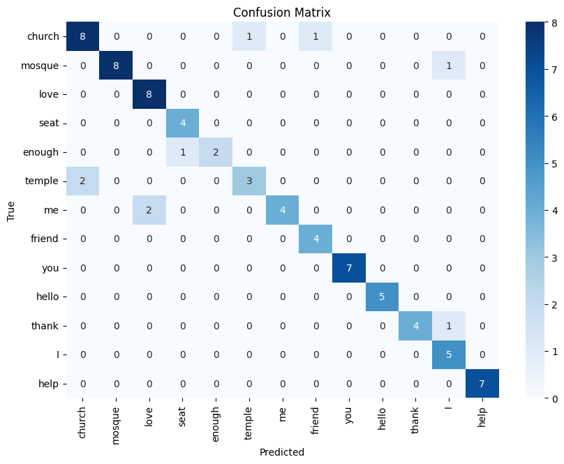

## Machine Learning Model 

- The Machine Learning model implements a hybrid CNN-RNN architecture. The CNN component implements [Mediapipe's CNN-based models](https://ai.google.dev/edge/mediapipe/solutions/vision/gesture_recognizer#models) which include BlazePalm and Hand Landmark model.
- The RNN component implements [Long Short Term Memory (LSTM)](https://www.mathworks.com/discovery/lstm.html#how-lstms-work).

## Analytics

- The ML model performed quite well with a test accuracy of 88.46% which is impressive. It was able to detect and recognize difficult KSL notations such as "help".
  

- However, the model had a few misclassifications for the respective classes.

